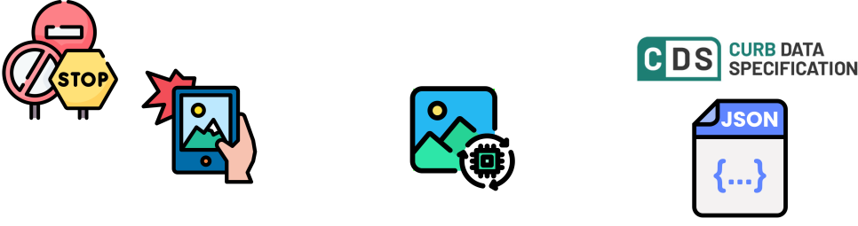
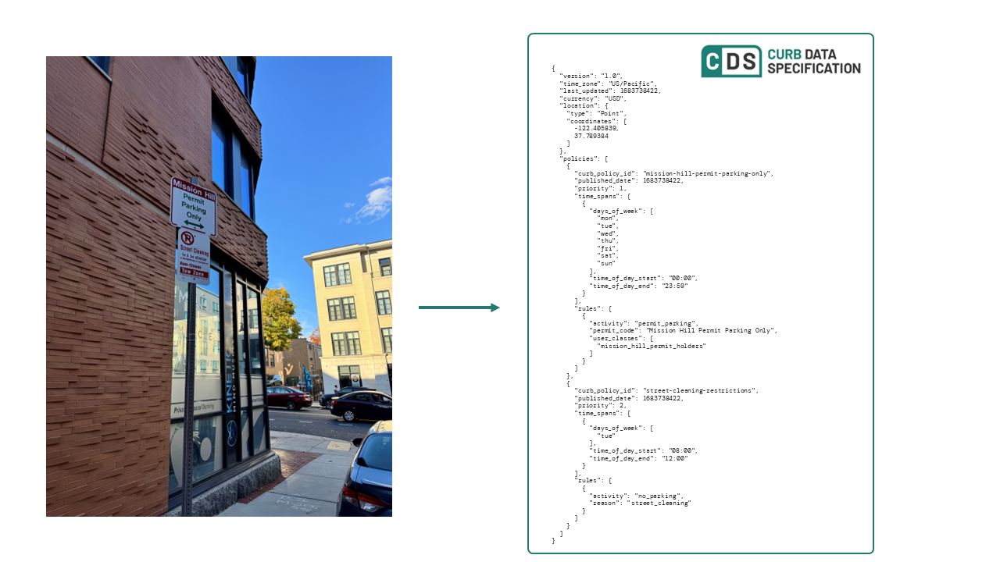

# Curb Sign Parser

Convert parking sign images into structured data that computers can understand, powered by AI that can see and interpret images.

## What Does This Package Do?

Have you ever been confused by a parking sign with multiple rules? This package helps computers understand these signs just like humans do. It:

1. Takes a photo of a parking sign
2. Uses advanced AI (called "multimodal LLMs") to "look" at and understand the sign
3. Converts the rules into a standardized format that other software can use

## Why Is This Useful?

- **For Developers**: Build apps that can understand parking rules automatically
- **For Cities**: Digitize entire parking sign networks without manual data entry
- **For Parking Apps**: Get reliable, structured data about where and when people can park
- **For Transportation Systems**: Integrate real-world parking rules into navigation and planning

## Understanding the Output

This package converts sign images into what's called "CDS" (Curb Data Specification) format from the [OpenMobility Foundation](https://www.openmobilityfoundation.org/about-cds/). Think of CDS as a universal language for describing parking rules. For example:

```json
{
    "policies": [{
        "time_spans": [{
            "days_of_week": ["mon", "tue", "wed", "thu", "fri"],
            "time_of_day_start": "09:00",
            "time_of_day_end": "18:00"
        }],
        "rules": [{
            "activity": "paid_parking",
            "max_stay": 120,
            "rate": {
                "rate": 2.00,
                "rate_unit": "hour"
            }
        }]
    }]
}
```

This structured format tells us: "On weekdays from 9 AM to 6 PM, parking is allowed for up to 2 hours at $2.00 per hour."


*Example: A parking sign (left) gets converted into structured data (right) that software systems can easily process*


## Installation

```bash
pip install git+ssh://git@github.com/hersh-gupta/curb-sign-parser.git/
```

## Quick Start

First, you'll need an API key from either Anthropic (Claude) or OpenAI (GPT-4). These are the AI services that power the image understanding.

### Basic Usage

```python
from curb_sign_parser import CurbSignParser

# Initialize with Claude (Anthropic's AI)
parser = CurbSignParser(
    api_key="your-anthropic-api-key",
    provider="claude"  # or "gpt4" for OpenAI's GPT-4
)

# Convert a sign image to structured data
sign_data = parser.parse_sign("path/to/sign.jpg")

# Print the rules in a readable format
for policy in sign_data.policies:
    for rule in policy.rules:
        print(f"Activity: {rule.activity}")
        if hasattr(rule, "rate"):
            print(f"Rate: ${rule.rate.rate}/{rule.rate.rate_unit}")
```

### Advanced Usage

```python
# Use GPT-4 Vision instead
parser = CurbSignParser(
    api_key="your-openai-api-key",
    provider="gpt4"
)

# Parse a sign and get the full CDS data
sign_data = parser.parse_sign("sign.jpg")

# Access location data (if available in the image)
if sign_data.location:
    print(f"Sign Location: {sign_data.location.coordinates}")
```

## Features

- **AI-Powered Vision**: Uses advanced AI models (Claude or GPT-4) to "see" and understand parking signs
- **Standardized Output**: Converts complex sign rules into the universal CDS format
- **Location Support**: Automatically extracts GPS coordinates from image metadata when available
- **Flexible Provider Support**: Works with either Anthropic's Claude or OpenAI's GPT-4
- **Format Handling**: Supports common image formats (JPEG, PNG, HEIF/HEIC)
- **Error Handling**: Robust validation and error checking for reliable operation

## How It Works

1. **Image Processing**: The package first processes and optimizes your sign image
2. **AI Analysis**: The image is sent to an AI model (Claude or GPT-4) that can both see and understand images
3. **Data Extraction**: The AI reads the sign and extracts all the parking rules
4. **Standardization**: The rules are converted into the standard CDS format
5. **Validation**: The data is checked for accuracy and completeness


## License

This project is licensed under the MIT License - see the [LICENSE](LICENSE) file for details.